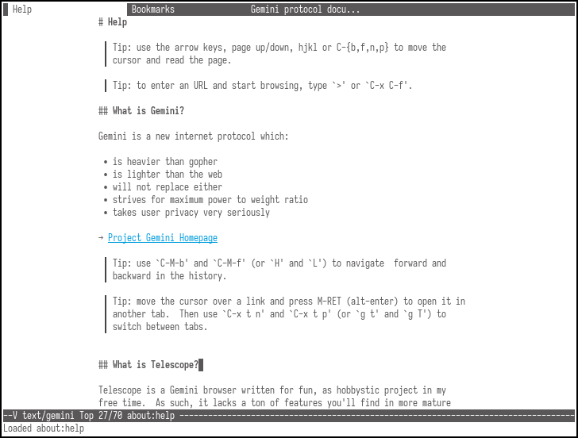

```
 _______         __
|_     _|.-----.|  |.-----.-----.----.-----.-----.-----.
  |   |  |  -__||  ||  -__|__ --|  __|  _  |  _  |  -__|
  |___|  |_____||__||_____|_____|____|_____|   __|_____|
                                           |__|
```

Telescope is a w3m-like browser for Gemini.

At the moment, it's something **a bit more than a working demo**.
However, it has already some interesting features, like streaming
pages, tabs, privsep, input from the minibuffer etc...

There are still various things missing or, if you prefer, various
things that you can help develop :)

 - UTF8 handling: it needs to handle non-ASCII characters in pages and
   in the minibuffer input
 - subscriptions
 - tofu oob verification
 - client certificates
 - add other GUIs: atm it uses only ncurses, but telescope shouldn't
   be restricted to TTYs only!
 - configuration file: even proposals are accepted.  It needs a way to
   define keybindings, colors etc in a way that will possibly work on
   more than one graphic libraries.




## Why yet another browser?

One of the great virtues of Gemini is its simplicity.  It means that
writing browsers or server is easy and thus a plethora of those
exists.  I myself routinely switch between a couple of them, depending
on my mood.

More browsers brings more stability as it became more difficult to
change the protocol, too.

However, Telescope was ultimately written for fun, on a whim, just to
play with ncurses, libtls, libevent and the macros from `sys/queue.h`,
but I'd like to finish it into a complete Gemini browser.


## Goals

 - Fun: hacking on Telescope should be fun.
 - Clean: write readable and clean code mostly following the style(9)
   guideline.  Don't become a kitchen sink.
 - Secure: write secure code with privilege separation to mitigate the
   security risks of possible bugs.
 - Fast: it features a modern, fast, event-based asynchronous I/O
   model, it shouldn't never lags behind the user input.
 - Cooperation: re-use existing conventions to allow inter-operations
   and easy migrations from/to other clients.


## TOFU

Telescope aims to use the "Trust, but Verify (where appropriate)"
approach outlined here:
[gemini://thfr.info/gemini/modified-trust-verify.gmi](gemini://thfr.info/gemini/modified-trust-verify.gmi).

The idea is to define three level of verification for a certificate:

 - **untrusted**: the server fingerprint does NOT match the stored
   value
 - **trusted**: the server fingerprint matches the stored one
 - **verified**: the fingerprint matches and has been verified
   out-of-band by the client.

Most of the time, the `trusted` level is enough, but where is
appropriate users should be able to verify out-of-band the
certificate.

At the moment there is no support for oob-verification though.


## Building

Telescope depends on ncursesw, libtls (from either LibreSSL or
libretls), libevent (either v1 or v2).

To build from a release tarball just execute:

	./configure
	make
	sudo make install

If you want to build from the git checkout, something that's
discouraged for users that don't intend to hack on telescope

	./autogen.sh
	./configure
	make
	sudo make install	# eventually

Please keep in mind that the main branch, from time to time, may be
accidentally broken on some platforms.  Telescope is developed
primarily on OpenBSD/amd64 and commits on the main branch don't get
always tested in other OSes.  Before tagging a release however, a
comprehensive testing on various platform is done to ensure everything
is working as intended.


## License

Telescope is distributed under a BSD-style licence.  The main code is
under the ISC but some files under `compat/` are BSD2 or BSD3.
